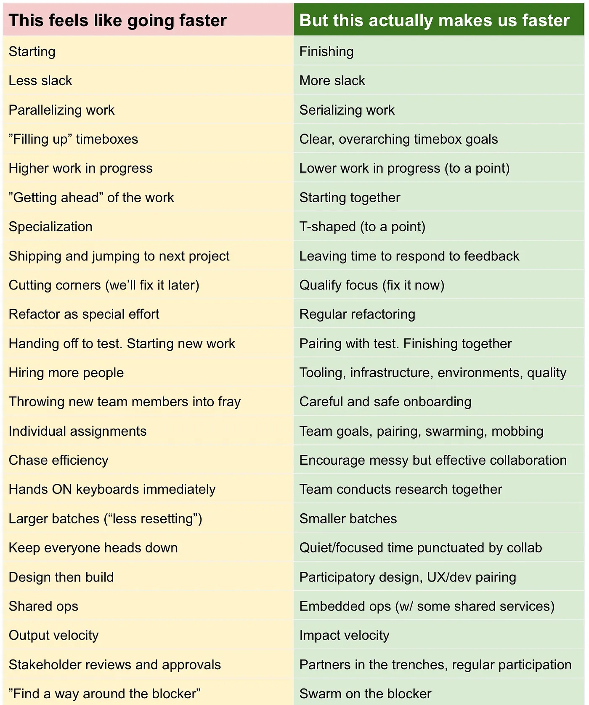
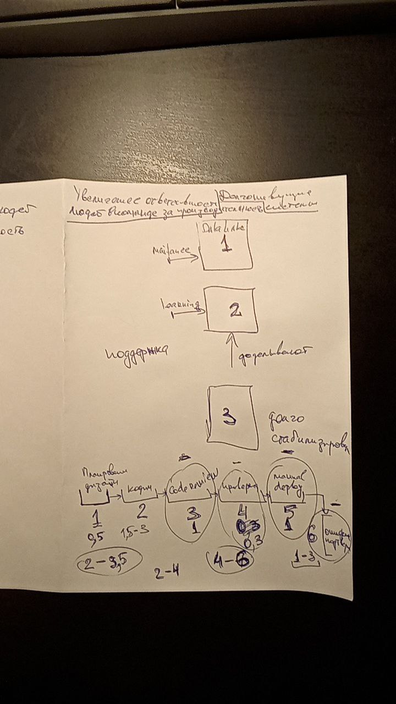

---
categories:
- Встречи
date: 2021-04-06
slug: meeting_10
---
# Встреча № 10

## Feels Like Faster vs. Is Actually Faster

<!-- more -->
## [Аудио](https://soundcloud.com/oleg-soroka/vstrecha-10)

<iframe width="100%" height="166" scrolling="no" frameborder="no" allow="autoplay" src="https://w.soundcloud.com/player/?url=https%3A//api.soundcloud.com/tracks/1630941843&color=%23ff5500&auto_play=false&hide_related=false&show_comments=true&show_user=true&show_reposts=false&show_teaser=true"></iframe>
<a href="https://soundcloud.com/oleg-soroka" title="Oleg Soroka" target="_blank" style="color: #cccccc; text-decoration: none;">Oleg Soroka</a> · <a href="https://soundcloud.com/oleg-soroka/vstrecha-10" title="Встреча #10" target="_blank" style="color: #cccccc; text-decoration: none;">Встреча #10</a>

<!-- more -->

## Таймкоды

- 01:00 - начало разбора таблицы <a href="#photo1">Feels Like Faster vs. Is Actually Faster</a>
- 01:45 - starting vs finishing
- 03:30 - less slack vs more slack
- 04:48 - parallelizing work vs serializing work
- 05:55 - "filling up" timeboxes vs clear, overarching timbox goals
- 07:46 - higher work in progress vs lower work in progress (to a point)
- 10:30 - "getting ahead" of the work vs starting together
- 14:25 - specialization vs t-shaped (to a point)
- 16:40 - shipping and jumping to next project vs leaving to respond to feedback
- 19:18 - cutting corners (we'll fix it later) vs quality focus (fix it now)
- 22:08 - refactor as special effort vs regular refactoring
- 23:38 - analysis paralysis
- 24:25 - handling off to test. starting new work vs pairing with test. finishing together
- 26:13 - hiring more people vs tooling, infrastructure, environments, quality
- 30:39 - throwing new team members into fray vs careful and safe onboarding
- 33:15 - individual assignments vs team goals, pairing, swarming, mobbing
- 35:42- chase efficiency vs encourage messy but effective collaboration
- 41:35 - heads on keyboards immediately vs team conducts research together
- 43:18 - larger batches ("less resetting") vs smaller batches
- 47:11 - keep everyone heads down vs quiet/focused time punctuated by collab
- 48:58 - метрики не во главе угла а для на подумать
- 50:00 - design then build vs participatory design, UX/dev pairing
- 52:40 - shared ops vs embedded ops (w/ some shared services)
- 56:00 - отсылка к [видео разбору CALMS](https://youtu.be/K7pR2zsGErc?list=PL4vA46bkT2dJSWqHJEWIo3BbXaZERH7cn)
- 58:23 - output velocity vs impact velocity
- 01:02:14 - stakeholder reviews and approvals vs partners in the trenches, regular participation
- 01:05:22 - "find a way around the blocker" vs swarm on the blocker
- 01:11:10 - разбор вопроса про ответственность за производительность: [иллюстрация 1](#photo_2021-04-13_21-46-54.jpg), [иллюстрация 2](#photo_2021-04-13_21-55-17.jpg)
- 01:43:28 - обсуждение после ответа на вопрос

## Материалы

<figure>
  
  <figcaption>Source: <a href="https://medium.com/hackernoon/feels-like-faster-vs-makes-us-faster-828686facc7e">Feels Like Faster vs. Is Actually Faster</a></figcaption>
</figure>

<figure>
  
  <figcaption>Иллюстрация №1 Виктора Фабриченко</figcaption>
</figure>

<figure>
  
  <figcaption>Иллюстрация №2 Виктора Фабриченко</figcaption>
</figure>

## Ссылки на упоминаемые материалы

- [Анти Jira](https://www.youtube.com/watch?v=VdwxfocVqcM)
